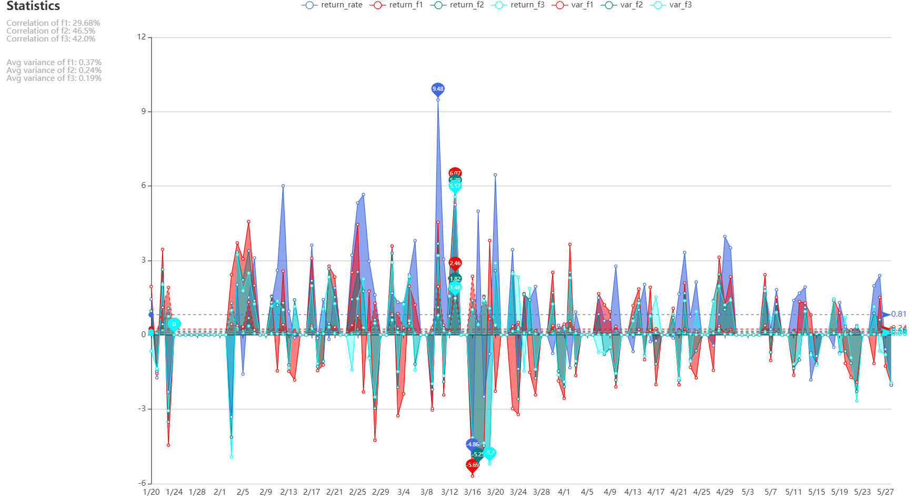
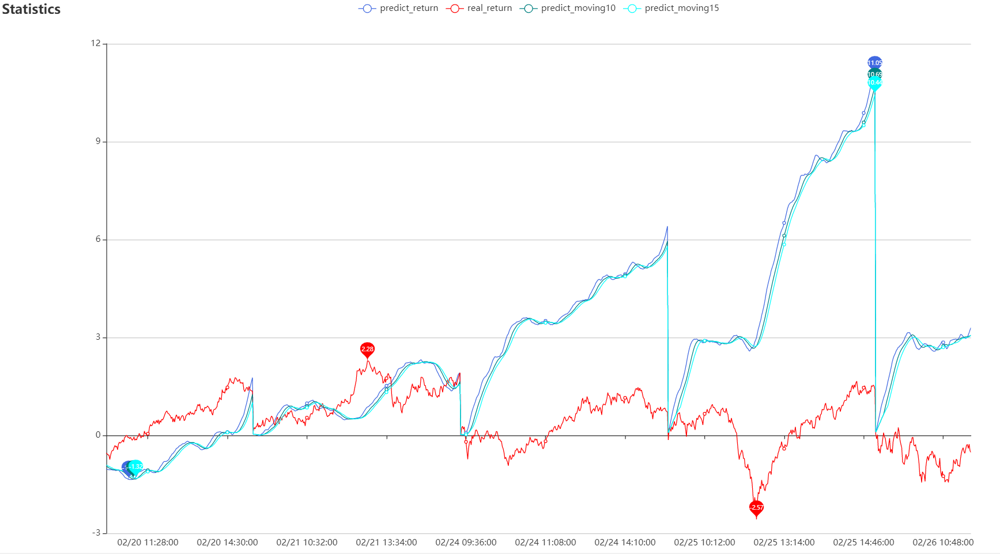
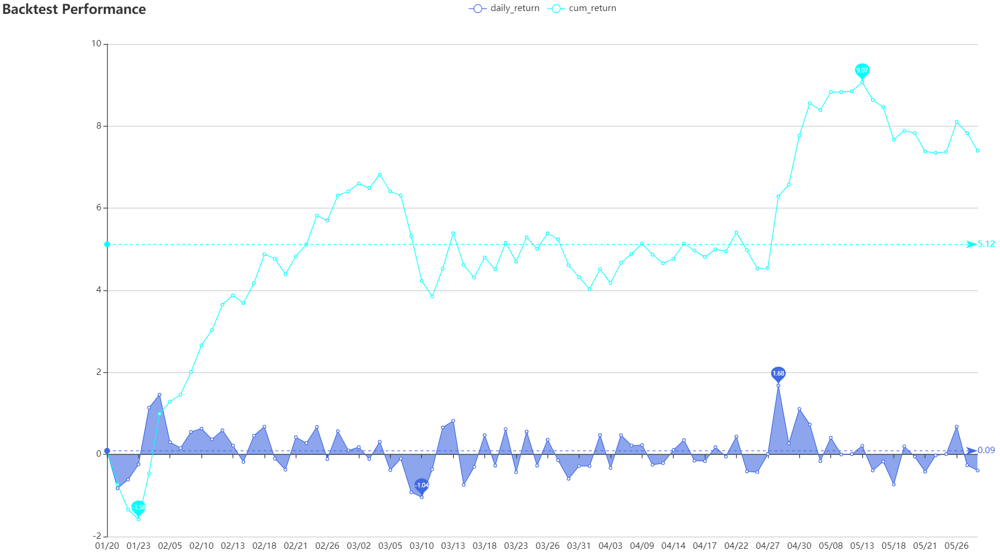

### Solver

#### 项目结构
```commandline
+---app // ETL/计算/后端服务代码
|   +---api
|   |   +---errors
|   |   |   \---__pycache__
|   |   +---routers // 路由api
|   |   |   \---__pycache__
|   |   \---__pycache__
|   +---assets // js 静态加载文件
|   +---charts
|   |   \---__pycache__
|   +---core
|   |   \---__pycache__
|   +---middleware
|   |   \---__pycache__
|   +---model
|   +---solve // 计算部分代码
|   |   \---__pycache__
|   +---static
|   \---__pycache__
+---docs // 解题文档
+---logs // 日志存放
+---resource // 数据源文件
|   +---1
|   \---2
\---__pycache__
```
#### 环境
Linux/Windows

Python3.5+

#### 启动方式
windows 
```commandline
./boot.bat
```
linux 
```commandline
chmod +x ./boot.sh
./boot.sh
```
依赖配置
```commandline
pip install -r requirements.txt
```

#### 问题1
[文档](docs/solve1.docx)

[收益序列分析](http://localhost:8000/api/index1/)
http://118.25.23.38:8070/api/index1/


[K线分析](http://localhost:8000/api/index1/kline)
http://118.25.23.38:8070/api/index1/kline

#### 问题2
[文档](docs/solve2.docx)

[收益序列分析](http://localhost:8000/api/index2/)
http://118.25.23.38:8070/api/index2/


[回测表现](http://localhost:8000/api/index2/backtest)
http://118.25.23.38:8070/api/index2/backtest


### Note
因个人服务器带宽原因，可能页面加载较慢，请耐心等待或尝试其他页面；部分页面可能因为渲染卡顿，取决于GPU性能
